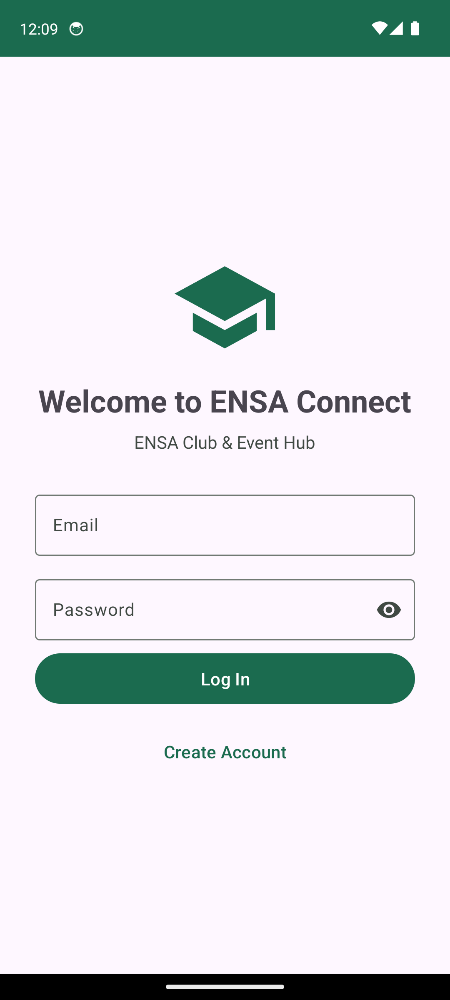
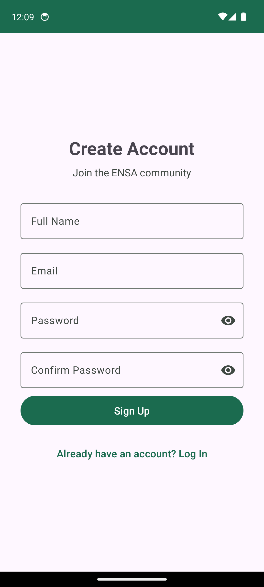
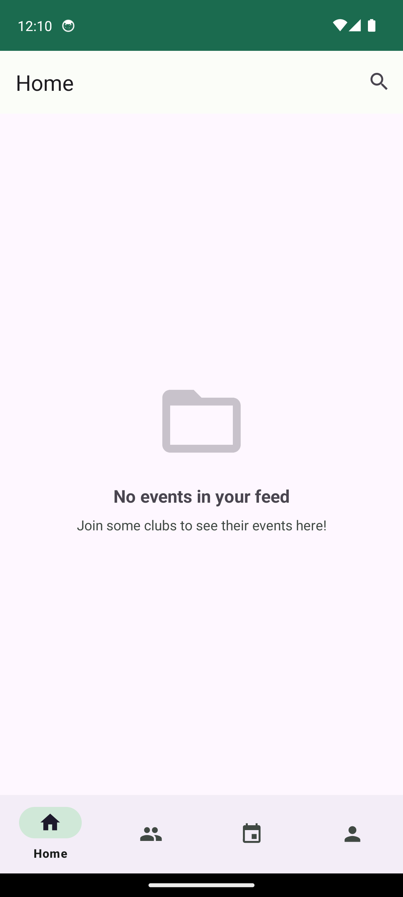
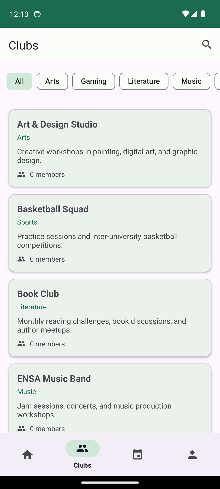
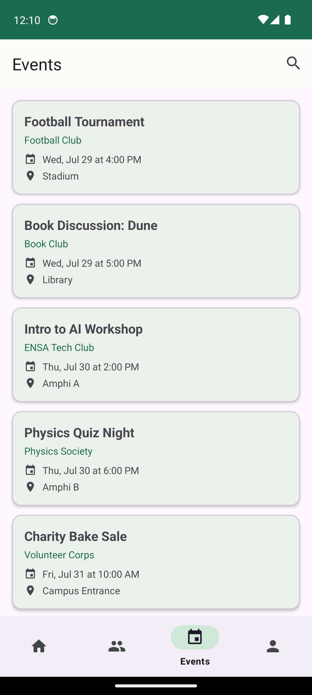
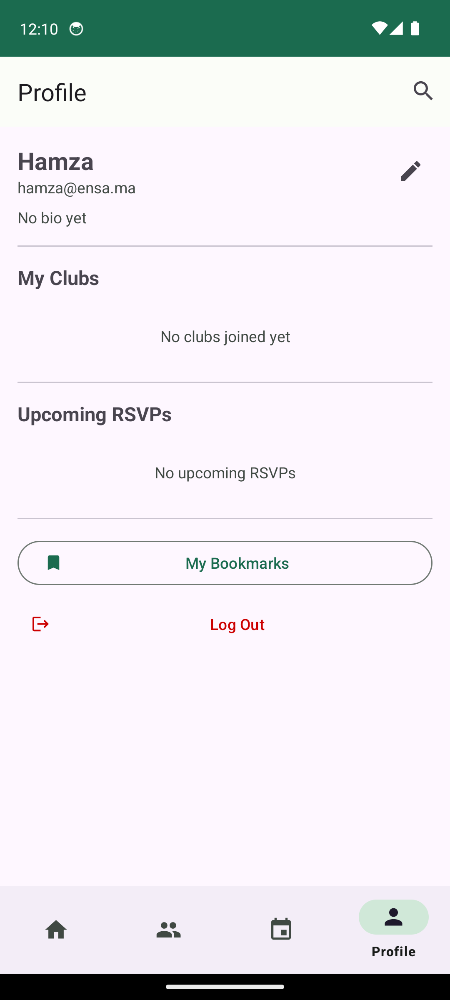
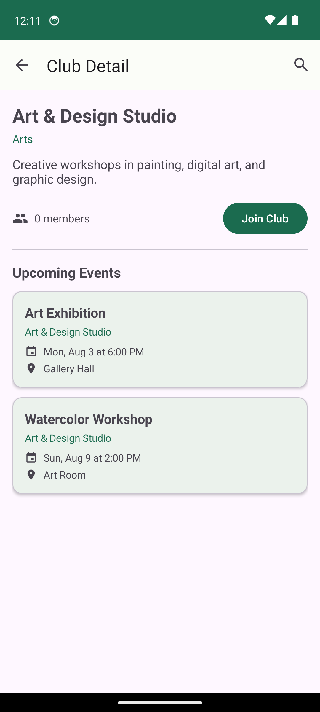
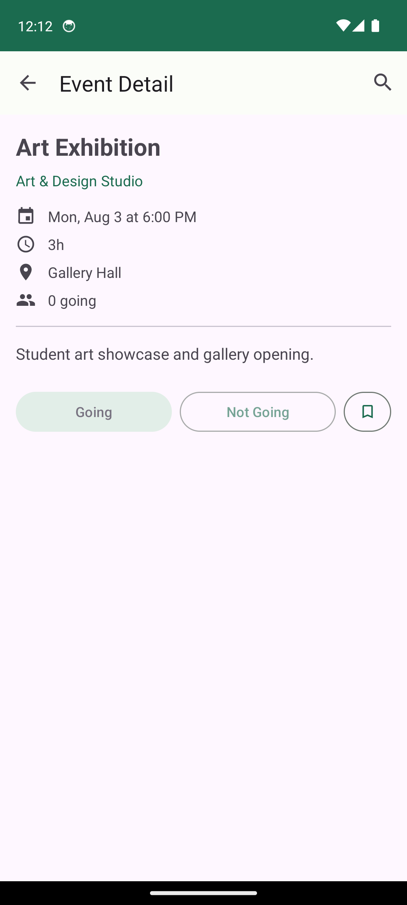
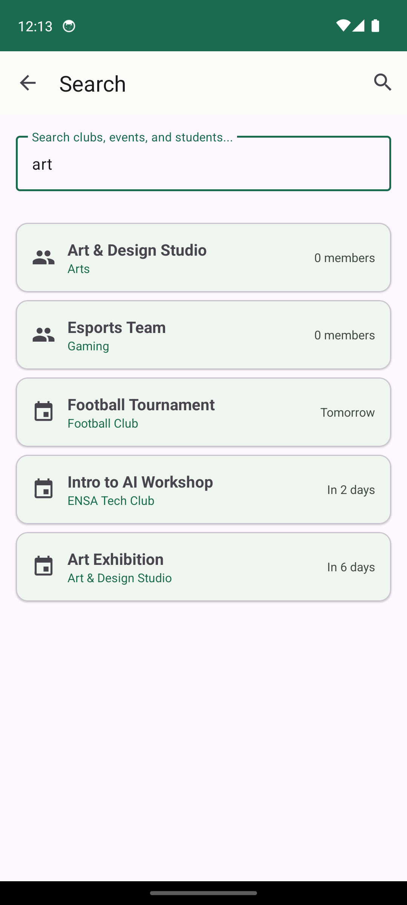

# ENSA Connect - Application Android

Une application Android de gestion des clubs et evenements etudiants, construite avec Java et Material Design 3.

## Captures d'ecran

### Authentification

<p align="center">
  
  &nbsp;&nbsp;&nbsp;
  
</p>

### Ecrans principaux

<p align="center">
  
  &nbsp;&nbsp;&nbsp;
  
  &nbsp;&nbsp;&nbsp;
  
</p>

### Profil, details et recherche

<p align="center">
  
  &nbsp;&nbsp;&nbsp;
  
  &nbsp;&nbsp;&nbsp;
  
</p>

<p align="center">
  
</p>

## Fonctionnalites

- **Authentification** : inscription et connexion par email/mot de passe, gestion de session
- **Clubs** : parcourir, filtrer par categorie, rejoindre/quitter un club
- **Evenements** : consulter les details, RSVP (Going/Not Going), bookmarks, rappels automatiques
- **Fil d'actualite** : evenements des clubs rejoints affiches sur l'accueil
- **Profil** : modifier son profil (nom, bio), consulter les profils des autres etudiants
- **Recherche** : recherche unifiee parmi les clubs, evenements et etudiants

## Stack Technique

- **Langage** : Java
- **SDK Minimum** : API 24 (Android 7.0 Nougat)
- **SDK Cible/Compilation** : API 34 (Android 14)
- **Systeme de build** : Gradle 8.4 avec Kotlin DSL (`build.gradle.kts`)
- **Plugin Android Gradle** : 8.2.2
- **Toolkit UI** : Material Design 3, AndroidX AppCompat, ConstraintLayout

## Structure du Projet

```
android/
├── app/
│   ├── src/main/
│   │   ├── java/com/valet/app/
│   │   │   ├── MainActivity.java
│   │   │   ├── ValetApplication.java
│   │   │   ├── auth/                  # Authentification
│   │   │   │   ├── LoginActivity.java
│   │   │   │   ├── SignupActivity.java
│   │   │   │   └── SessionManager.java
│   │   │   ├── data/                  # Couche de donnees (Room)
│   │   │   │   ├── AppDatabase.java
│   │   │   │   ├── dao/              # Data Access Objects
│   │   │   │   ├── entity/           # Entites (User, Club, Event, etc.)
│   │   │   │   └── repository/       # Repositories
│   │   │   ├── ui/                    # Fragments UI
│   │   │   │   ├── home/
│   │   │   │   ├── clubs/
│   │   │   │   ├── events/
│   │   │   │   ├── profile/
│   │   │   │   ├── search/
│   │   │   │   └── bookmarks/
│   │   │   └── util/                  # Utilitaires
│   │   ├── res/
│   │   │   ├── layout/               # Layouts XML
│   │   │   ├── navigation/           # Graphe de navigation
│   │   │   ├── menu/                 # Menus (bottom nav, toolbar)
│   │   │   ├── values/               # Chaines, couleurs, themes
│   │   │   └── drawable/             # Icones et drawables
│   │   └── AndroidManifest.xml
│   ├── build.gradle.kts
│   └── proguard-rules.pro
├── screenshots/                       # Captures d'ecran
├── gradle/wrapper/
├── build.gradle.kts
├── settings.gradle.kts
└── gradle.properties
```

## Prerequis

- **Java 17** ou superieur
- **Android SDK** avec :
  - Platform SDK 34 (`platforms;android-34`)
  - Build Tools 34.0.0 (`build-tools;34.0.0`)

### Installation du Android SDK (macOS)

```bash
brew install --cask android-commandlinetools
sdkmanager "platforms;android-34" "build-tools;34.0.0" "platform-tools"
```

Ensuite, creez un fichier `local.properties` a la racine du projet :

```properties
sdk.dir=/opt/homebrew/share/android-commandlinetools
```

Ou definissez la variable d'environnement `ANDROID_HOME` a la place.

## Compilation

### Build debug

```bash
./gradlew assembleDebug
```

L'APK sera genere dans `app/build/outputs/apk/debug/app-debug.apk`.

### Build release

```bash
./gradlew assembleRelease
```

> Note : Les builds release necessitent une configuration de signature. Consultez la [documentation de signature Android](https://developer.android.com/studio/publish/app-signing) pour les instructions.

### Build propre

```bash
./gradlew clean assembleDebug
```

## Execution

### Sur un appareil connecte ou un emulateur

```bash
./gradlew installDebug
```

Ou ouvrez le projet dans Android Studio et cliquez sur **Run**.

## Dependances

| Bibliotheque | Version | Utilisation |
|--------------|---------|-------------|
| `androidx.appcompat:appcompat` | 1.6.1 | Composants Activity et UI retro-compatibles |
| `com.google.android.material:material` | 1.11.0 | Composants et theming Material Design 3 |
| `androidx.constraintlayout:constraintlayout` | 2.1.4 | Gestionnaire de layout flexible |
| `androidx.room:room-runtime` | 2.6.1 | Base de donnees locale (ORM) |
| `androidx.navigation:navigation-fragment` | 2.7.7 | Navigation entre fragments |
| `androidx.navigation:navigation-ui` | 2.7.7 | Integration UI de la navigation |
| `androidx.recyclerview:recyclerview` | 1.3.2 | Affichage de listes |
| `androidx.work:work-runtime` | 2.9.0 | Taches en arriere-plan (rappels) |

## Licence

Tous droits reserves.
